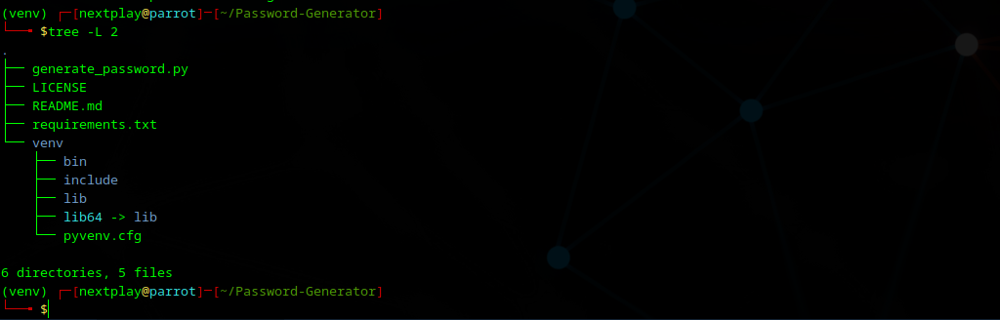

# 🔐 Password Generator

A simple Python tool that generates strong, random passwords of any length using letters, numbers, and symbols. Useful for creating secure credentials quickly.

---

## 🚀 Features

- Generate strong passwords
- Mix of uppercase, lowercase, digits, and symbols
- Simple and fast to use
- Fully open-source

---

## 🛠️ Project Structure

```text
Password-Generator/
├── generate_password.py   # Main script
├── README.md              # Documentation
└── screenshots/
    └── p-g.png            # Screenshot image
```    

📸 Screenshot



```text

🧪 How to Run

1. Clone this repo:

git clone https://github.com/nextplay-box/Password-Generator.git
cd Password-Generator

2. (Optional) Create and activate a virtual environment:

python3 -m venv venv
source venv/bin/activate   # On Windows: venv\Scripts\activate

3. Run the script:

python generate_password.py

```

```text

🤝 License
Feel free to use, modify, and share this project.
Made by nextplay-box

```

👨‍💻 Author
Created with 💡 by Augustine Anapuwa Oputa
